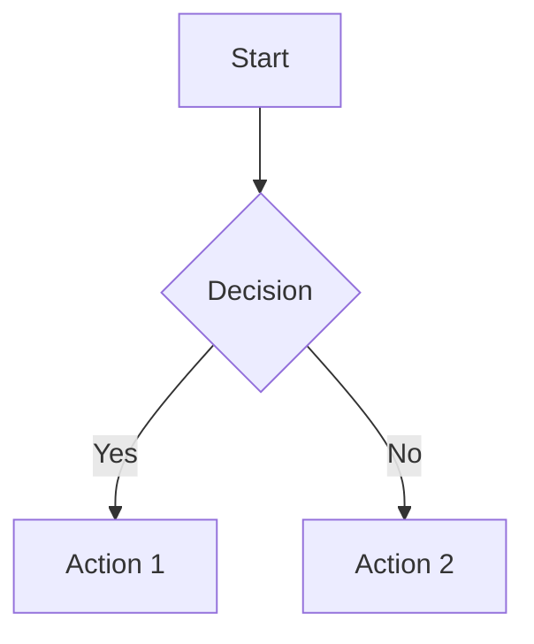
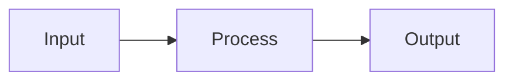
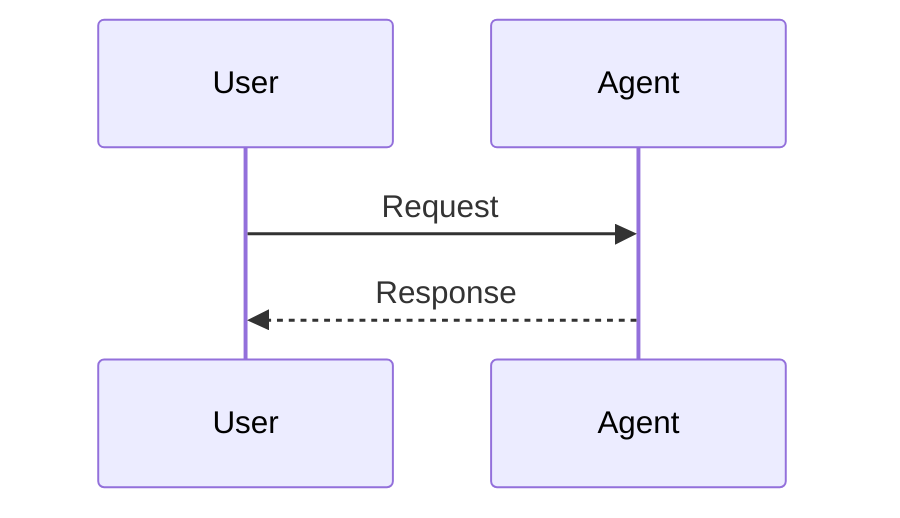
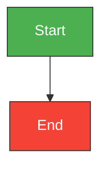

# Visualization Guide

This skill documents how to render visual content inside session messages — code blocks, Mermaid diagrams, and math formulas.

---

## 1. Code Blocks

Wrap code in triple backticks with an optional language tag. The frontend renders them as styled, copyable code blocks.

### Supported Language Tags

| Tag | Renders As |
|-----|-----------|
| `markdown` | Markdown source |
| `text` / `txt` | Plain text |
| `python` | Python with syntax highlighting |
| `json` | JSON with syntax highlighting |
| `javascript` / `js` | JavaScript |
| `html` | HTML |
| `css` | CSS |
| `bash` / `shell` | Shell commands |
| `yaml` / `yml` | YAML |
| `sql` | SQL |
| `java`, `go`, `rust`, `c`, `cpp` | Other languages |
| _(no tag)_ | Plain unstyled code |

### Examples

**Markdown source block:**

````markdown
```markdown
# Heading

- Item 1
- Item 2
```
````

**Python block:**

````markdown
```python
def hello():
    print("hello world")
```
````

**JSON block:**

````markdown
```json
{"key": "value"}
```
````

---

## 2. Mermaid Diagrams

Mermaid is a Markdown-based diagramming syntax. The frontend **live-renders** Mermaid into graphical diagrams inside the message.

### Code Block Tags

| Tag | Behavior |
|-----|----------|
| `mermaid` | Live-renders into a diagram |
| `mmd` | Same as `mermaid` — live-renders into a diagram |
| `mermaid-source` | Displays source code as text (no rendering) |

### Basic Diagram Types

**Flowchart (top-down):**

````

````

**Flowchart (left-right):**

````

````

**Sequence diagram:**

````

````

### Node Shapes

| Syntax | Shape |
|--------|-------|
| `[Text]` | Rectangle |
| `(Text)` | Rounded rectangle |
| `([Text])` | Stadium / pill |
| `[[Text]]` | Subroutine / double-border |
| `[(Text)]` | Cylinder (database) |
| `((Text))` | Circle |
| `{{Text}}` | Diamond (decision) |
| `>Text]` | Asymmetric hexagon |
| `[/Text/]` | Parallelogram |
| `[\Text\]` | Alt parallelogram |
| `[/Text\]` | Trapezoid |
| `[\Text/]` | Alt trapezoid |
| `((("Text")))` | Double circle |

### Coloring Nodes

Use `style` statements after the graph definition:

````

````

Common color palette:
- Green `#4CAF50` — start/success
- Red `#F44336` — error/stop
- Orange `#FF9800` — decision/warning
- Blue `#2196F3` — info/process
- Purple `#9C27B0` — special
- Cyan `#00BCD4` — integration
- Teal `#009688` — data

### Links and Labels

````
```mermaid
graph TD
    A -->|label| B
    A -->|Yes| C
    A -->|No| D
    A -.-> E          %% dotted line
    A ==> F           %% thick line
```
````

### When to Use Each Tag

- Use ` ```mermaid ` when you want the diagram to render as a graphic.
- Use ` ```mmd ` as an alternative (identical rendering).
- Use ` ```mermaid-source ` when you want to show the Mermaid source code as readable text (e.g., teaching, explaining syntax).

---

## 3. Math / Formula Rendering

The platform supports LaTeX math rendering via KaTeX/MathJax.

### Block-Level Formulas

Wrap in `$$...$$` on their own lines. Renders as a centered, standalone equation block.

````
$$
E = mc^2
$$
````

### Inline Formulas

Wrap in `$...$` within text. Renders the formula inline with surrounding text.

````
The energy-mass equivalence is $E = mc^2$, where $c$ is the speed of light.
````

### Complex Equations with Variable Explanations

When explaining equations, put the equation, variable definitions, and derived formulas in a single `$$` block using the `aligned` environment:

````
$$
\begin{aligned}
v &= v_0 + at \\
\text{where:} \quad & v = \text{final velocity}, \quad v_0 = \text{initial velocity} \\
& a = \text{acceleration}, \quad t = \text{time} \\
\text{Solving for } t: \quad & t = \frac{v - v_0}{a}
\end{aligned}
$$
````

### Supported LaTeX Elements

- Fractions: `\frac{a}{b}`
- Subscripts/superscripts: `x_i`, `x^2`
- Greek letters: `\alpha`, `\beta`, `\gamma`, `\delta`, `\pi`, `\sigma`
- Summation/integral: `\sum_{i=1}^{n}`, `\int_a^b`
- Square root: `\sqrt{x}`, `\sqrt[n]{x}`
- Matrices: `\begin{matrix} ... \end{matrix}`
- Aligned equations: `\begin{aligned} ... \end{aligned}`
- Cases: `\begin{cases} ... \end{cases}`

---

## 4. Quick Reference

| What You Want | Syntax |
|---------------|--------|
| Show code snippet | ` ```language ... ``` ` |
| Draw a flowchart | ` ```mermaid graph ... ``` ` |
| Show Mermaid source | ` ```mermaid-source ... ``` ` |
| Block math formula | `$$ ... $$` |
| Inline math formula | `$ ... $` |
