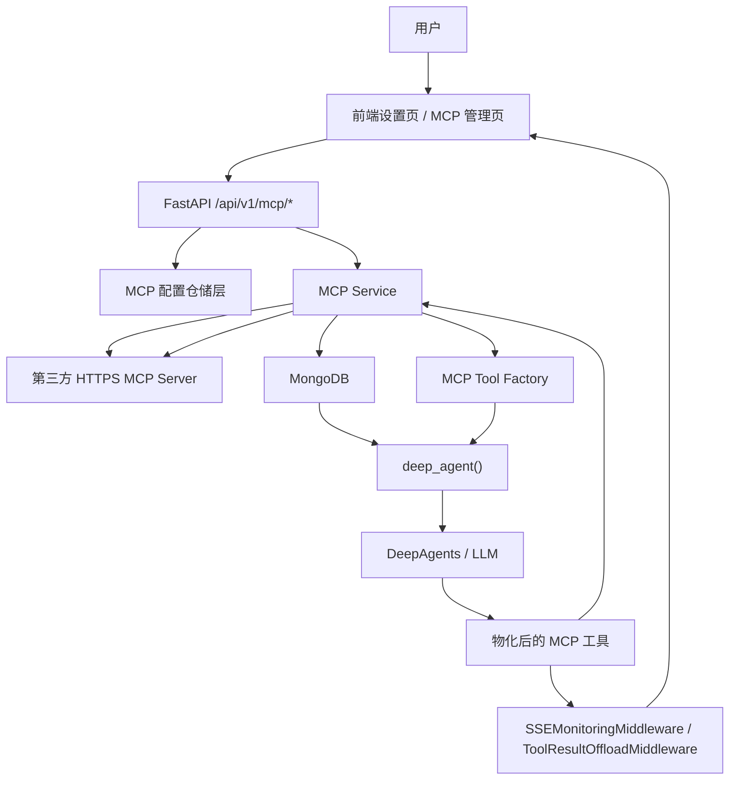

# ScienceClaw 第三方 HTTPS MCP 接入设计方案

本文档定义 ScienceClaw 接入第三方 **HTTPS MCP Server** 的完整实现方案。目标是把第三方 MCP 作为新的工具来源接入 ScienceClaw，并提供前端管理界面、后端配置持久化、Agent 工具注入、逐工具启用/关闭、以及面向 LLM 的稳定暴露策略。

本文档只覆盖 `https` 传输方式，不覆盖 `stdio`、本地进程拉起、宿主机桥接、sidecar、或桌面端专用接入模式。

---

## 目录

- [目标与范围](#目标与范围)
- [现状判断](#现状判断)
- [目标架构](#目标架构)
- [运行链路](#运行链路)
- [后端模块落点](#后端模块落点)
- [后端实现细化](#后端实现细化)
- [MongoDB 集合结构](#mongodb-集合结构)
- [API 设计](#api-设计)
- [Agent 工具注入点](#agent-工具注入点)
- [前端页面结构](#前端页面结构)
- [前端实现细化](#前端实现细化)
- [命名空间与鉴权策略](#命名空间与鉴权策略)
- [LLM 暴露策略](#llm-暴露策略)
- [Schema 映射规则](#schema-映射规则)
- [返回结果归一化规则](#返回结果归一化规则)
- [逐工具启用关闭策略](#逐工具启用关闭策略)
- [安全要求](#安全要求)
- [实现触点清单](#实现触点清单)
- [分批实现路线](#分批实现路线)
- [批次内最小增量拆分](#批次内最小增量拆分)
- [小增量表格版](#小增量表格版)
- [测试规划](#测试规划)
- [MVP 与后续阶段](#mvp-与后续阶段)

---

## 目标与范围

### 目标

1. 支持用户在 ScienceClaw 中配置第三方 HTTPS MCP Server。
2. 支持在前端管理 MCP Server，包括新增、编辑、删除、启用、停用、验证、刷新工具目录。
3. 支持把第三方 MCP 暴露出的工具同步到 ScienceClaw 的工具面。
4. 支持每个 MCP 工具逐个启用/关闭。
5. 支持将已启用的 MCP 工具作为普通工具暴露给 DeepAgents/LLM。
6. 支持在前端区分 MCP 工具来源，并显示基础元数据与执行结果。

### 非目标

1. 不支持 `stdio` 传输。
2. 不支持本地宿主机进程管理。
3. 不支持在当前阶段替换现有 REST sandbox 主执行链。
4. 不支持将 MCP 直接暴露为“协议”给 LLM。
5. 不支持系统级共享 MCP Server。第一阶段只做用户级 MCP Server。

### 核心原则

1. **MCP 是新的工具源，不是新的主 backend。**
2. **对 LLM 暴露的是普通工具，不是 MCP 连接细节。**
3. **只暴露已验证、已启用、未屏蔽的 MCP 工具。**
4. **URL、token、headers 等敏感配置永不暴露给 LLM。**

---

## 现状判断

当前项目的核心运行链是：

- Agent 侧通过 `backend.deepagent.agent.deep_agent()` 汇总工具并创建 DeepAgent。
- Sandbox 主能力通过 `FullSandboxBackend` 调用 `/v1/shell/*`、`/v1/file/*` 等 REST 端点。
- 前端已经存在外置工具页、技能页、设置页，以及工具事件展示链路。

这意味着：

1. 第三方 MCP 最自然的接入方式，是新增一类 **远程工具提供者**。
2. 不应为了接入 MCP 去重写 `FullSandboxBackend`。
3. 工具展示层已经具备兼容空间，重点在后端工具物化和配置治理。

### 项目实际对齐约束

1. 当前 `backend/mcp/*` 与 `backend/route/mcp.py` 不存在，属于新增模块。
2. 当前 `backend.deepagent.agent.deep_agent(...)` 已经是 async 函数，并且参数中已有 `user_id`，适合做用户级 MCP 工具查询和注入。
3. 当前 `backend/deepagent/sse_protocol.py` 已有 `_extra_meta` 机制和 `register_sandbox_tool(...)`，MCP 元数据扩展应复用这个机制，新增 `register_mcp_tool(...)`，不要重写整个 SSE 协议层。
4. 当前前端 `frontend/src/constants/tool.ts` 和 `frontend/src/composables/useTool.ts` 已存在 “MCP Sandbox” 相关映射与 `mcp_` 前缀识别。第三方 HTTPS MCP 必须用 `tool_meta.mcp === true` 或 `source_type === "https_mcp"` 区分，避免和旧 sandbox 工具显示逻辑混淆。
5. 当前前端国际化目录实际存在 `frontend/src/locales/zh.ts`、`frontend/src/locales/en.ts`、`frontend/src/locales/index.ts`，新增文案应直接落到这两个语言文件。

---

## 目标架构

### 总体架构



### 设计要点

1. 前端只调用本项目后端，不直接连第三方 MCP。
2. 后端保存 MCP Server 配置和工具目录缓存。
3. Agent 创建时，从数据库读取当前用户可用的 MCP 工具并物化为普通工具。
4. LLM 调用的始终是 ScienceClaw 内部包装后的工具。
5. 第三方 MCP 的 `tools/list` 和 `tools/call` 都由后端统一代理。

---

## 运行链路

### A. 新增/编辑 MCP Server

1. 用户在设置页填写：
   - 名称
   - `https://...` 端点
   - 鉴权方式
   - 鉴权信息
2. 前端调用 `POST /api/v1/mcp/servers` 或 `PUT /api/v1/mcp/servers/{server_id}`。
3. 后端校验：
   - 当前用户身份
   - URL 必须为 `https`
   - 鉴权配置合法
4. 后端存储配置到 `mcp_servers`。
5. 若请求携带 `verify_now=true`，后端立即执行 `initialize -> tools/list`。
6. 验证结果和工具目录缓存回写数据库。

### B. 刷新工具目录

1. 用户点击“刷新工具”。
2. 前端调用 `POST /api/v1/mcp/servers/{server_id}/refresh-tools`。
3. 后端重新请求第三方 MCP：
   - `initialize`
   - `tools/list`
4. 同步更新 `mcp_tools`：
   - 新工具插入
   - 已存在工具更新 schema/描述/时间戳
   - 对远端已消失的工具标记 `removed=true`

### C. 创建 Agent 会话

1. `deep_agent()` 先加载内置工具、ToolUniverse 工具、外置 `Tools/` 工具。
2. 再查询当前用户：
   - `mcp_servers.enabled = true`
   - `mcp_servers.verify_status = healthy`
   - `mcp_tools.enabled = true`
   - `mcp_tools.removed = false`
3. 将这些 MCP 工具物化为 LangChain/DeepAgents 工具对象。
4. 与现有工具列表合并，注入 `create_deep_agent(...)`。

### D. LLM 调用 MCP 工具

1. LLM 只看到包装后的工具名、描述、参数 schema。
2. LLM 发起函数调用。
3. MCP Tool Wrapper 根据本地元数据找到：
   - `server_id`
   - `original_tool_name`
4. 后端对第三方 MCP 发起 `tools/call`。
5. 返回结果先做统一归一化，再交给：
   - `ToolResultOffloadMiddleware`
   - `SSEMonitoringMiddleware`
6. 前端按普通工具事件展示，但工具元数据里带上 `mcp` 来源标识。

---

## 后端模块落点

建议新增如下模块：

```text
ScienceClaw/backend/mcp/
  __init__.py
  schemas.py
  crypto.py
  repository.py
  client.py
  service.py
  tool_factory.py
```

### 各模块职责

#### `backend/mcp/schemas.py`

定义：

- `MCPServerConfig`
- `CreateMCPServerRequest`
- `UpdateMCPServerRequest`
- `MCPToolRecord`
- `ToggleMCPServerRequest`
- `ToggleMCPToolRequest`

#### `backend/mcp/crypto.py`

职责：

- 对 bearer token 和 secret headers 做加密/解密
- 屏蔽前端回包时的敏感字段

要求：

- 不把明文 token 直接返回给前端
- 不把明文 token 写入日志

#### `backend/mcp/repository.py`

职责：

- 封装 `mcp_servers` 和 `mcp_tools` 集合读写
- 屏蔽 Mongo 查询细节

#### `backend/mcp/client.py`

职责：

- 封装第三方 HTTPS MCP 的 JSON-RPC 请求
- 支持：
  - `initialize`
  - `tools/list`
  - `tools/call`

要求：

- 使用统一超时
- 统一错误格式
- 严格只允许 `https`

#### `backend/mcp/service.py`

职责：

- Server 验证
- 工具同步
- 工具启停
- 为 Agent 提供“当前用户可用工具列表”

#### `backend/mcp/tool_factory.py`

职责：

- 把 `mcp_tools` 记录物化为 LangChain/DeepAgents 可调用工具
- 生成规范化工具名
- 生成 Pydantic 输入 schema
- 统一返回格式

---

## 后端实现细化

### 1. 路由与配置接入

新增路由文件：

- `ScienceClaw/backend/route/mcp.py`

并在 `ScienceClaw/backend/main.py` 按现有风格挂载：

- `app.include_router(mcp_router, prefix="/api/v1")`

建议新增配置项：

- `MCP_CONFIG_ENCRYPTION_KEY`
- `MCP_REQUEST_TIMEOUT_MS`
- `MCP_REFRESH_TTL_SECONDS`

规则：

1. `MCP_CONFIG_ENCRYPTION_KEY` 用于加密 bearer token 和 secret header。
2. 若加密 key 缺失，后端应拒绝保存任何包含 secret 的 MCP 配置。
3. 超时与刷新 TTL 只做部署级默认值，不由前端覆盖。

### 2. 领域对象与校验

建议 `schemas.py` 拆成请求/响应/内部对象三类：

1. 请求模型
   - `CreateMCPServerRequest`
   - `UpdateMCPServerRequest`
   - `VerifyMCPServerRequest`
   - `RefreshMCPServerToolsRequest`
   - `ToggleMCPServerRequest`
   - `ToggleMCPToolRequest`
2. 响应模型
   - `MCPServerListItem`
   - `MCPServerDetailItem`
   - `MCPToolListItem`
   - `MCPVerifyResult`
   - `MCPRefreshResult`
3. 内部对象
   - `MCPServerDoc`
   - `MCPToolDoc`
   - `MCPAuthConfig`
   - `MCPHeaderSecret`

核心校验规则：

1. `name` 2-64 字符，去首尾空白后不能为空。
2. `endpoint_url` 必须以 `https://` 开头。
3. `bearer` 模式必须提供 token。
4. `headers` 模式必须提供至少一条 header。
5. `headers[].name` 需符合 header token 语法，不允许空格和控制字符。
6. 同一用户下 `slug` 必须唯一。

### 3. 仓储层职责

`repository.py` 只做集合读写，不做业务判断。建议方法如下：

- `list_servers(user_id)`
- `get_server(server_id, user_id)`
- `create_server(doc)`
- `update_server(server_id, user_id, patch)`
- `delete_server(server_id, user_id)`
- `list_tools_by_server(server_id, user_id)`
- `list_enabled_tools_by_user(user_id)`
- `upsert_tools_from_remote(server_id, user_id, tools)`
- `mark_removed_tools(server_id, user_id, missing_tool_names)`
- `toggle_server_enabled(server_id, user_id, enabled)`
- `toggle_tool_enabled(tool_id, user_id, enabled)`
- `touch_verify_result(server_id, user_id, result)`

同步时的保留策略：

1. 用 `(server_id, original_name)` 匹配远端工具。
2. 若 schema 变化，更新描述、schema、时间戳，但保留本地 `enabled` 状态。
3. 若工具远端消失，只标记 `removed=true`，不立即物理删除。

### 4. HTTPS MCP 客户端

`client.py` 负责和第三方 MCP Server 直接通信，只实现三个动作：

1. `initialize`
2. `tools/list`
3. `tools/call`

建议统一使用 JSON-RPC 2.0 包装：

```json
{
  "jsonrpc": "2.0",
  "id": "req-uuid",
  "method": "tools/list",
  "params": {}
}
```

客户端要求：

1. 只允许 `https`。
2. 默认超时 10-15 秒，按部署配置可调。
3. 失败时返回统一错误对象，不抛裸异常到上层。
4. 每次请求都重新注入解密后的 auth 头。

`initialize` 只用于探测连接可用性和 server 能力，不应把 MCP 协议细节暴露给前端或 LLM。

### 5. 服务层编排

`service.py` 建议承担完整流程编排：

1. 创建/更新 server
   - 规范化 `slug`
   - 加密 secret
   - 写入数据库
   - 可选立即 verify
2. 验证 server
   - 先 `initialize`
   - 再 `tools/list`
   - 失败时写 `verify_status=error`
   - 成功时写 `verify_status=healthy`
3. 刷新工具
   - 拉取远端工具
   - 计算新增/更新/删除差异
   - 更新 `mcp_tools`
4. 提供 agent 侧工具列表
   - 只返回当前用户、已启用、已验证、未移除的工具
   - 返回 wrapper 所需的完整本地元数据

建议在服务层统一生成以下状态：

- `unknown`
- `healthy`
- `error`

以及以下工具差异计数：

- `added_count`
- `updated_count`
- `removed_count`

### 6. Tool 物化层

`tool_factory.py` 负责把 `MCPToolDoc` 转成 LangChain/DeepAgents 工具对象。

建议每个工具 wrapper 固定包含：

1. `name` = `mcp__{server_slug}__{tool_slug}`
2. `description` = `[MCP:{server_name}] {description}`
3. `args_schema` = 由归一化 schema 生成的 Pydantic 模型
4. `func` = 本地闭包，内部调用 `tools/call`

工具名生成规则：

1. 全部小写。
2. 非字母数字转下划线。
3. 连续下划线压缩为一个。
4. 与现有内置工具名不得冲突。

若冲突，后端应拒绝保存或自动追加稳定后缀，并在前端明确提示。

### 7. Agent 注入链路

`backend/deepagent/agent.py` 的注入顺序建议保持：

1. 内置工具
2. ToolUniverse 工具
3. 外置 `Tools/` 工具
4. 当前用户 MCP 工具

实现上建议在 `deep_agent(...)` 中完成用户级查询并追加 wrapper，而不是把 MCP 逻辑塞回 `FullSandboxBackend`。

建议伪代码：

```python
mcp_tools = await list_enabled_mcp_tool_wrappers(user_id)
tools.extend(mcp_tools)
```

### 8. SSE 与事件元数据

`backend/deepagent/sse_protocol.py` 需要扩展工具元数据，建议至少加：

- `mcp: true`
- `source_type: "https_mcp"`
- `server_id`
- `server_name`
- `server_slug`
- `tool_id`
- `original_tool_name`

建议在 `SSEProtocolManager` 上新增 `register_mcp_tool(...)`，内部复用当前 `ToolRegistry._extra_meta` 机制写入这些字段；不要把这些动态字段塞进 `ToolMeta.__slots__`。

`ToolMetaData` 的前端类型也要同步加这些字段，但前端展示只读，不允许回写敏感配置。

### 9. 状态流转与错误边界

推荐的状态流转：

1. 创建时 `verify_status=unknown`
2. verify 成功后 `verify_status=healthy`
3. 远端超时/鉴权失败/协议错误时 `verify_status=error`
4. endpoint 或 auth 改动后自动回到 `unknown`

错误边界要求：

1. 不回显 token、header 值、完整远端响应体。
2. 前端只拿到稳定错误摘要和可读原因。
3. 日志需要脱敏远端地址中的 query 和凭证。

### 10. 索引与一致性

建议补充索引：

`mcp_servers`

- `{ user_id: 1, enabled: 1, verify_status: 1 }`
- `{ user_id: 1, slug: 1 } unique`
- `{ user_id: 1, endpoint_url: 1 }`

`mcp_tools`

- `{ server_id: 1, original_name: 1 } unique`
- `{ user_id: 1, canonical_name: 1 } unique`
- `{ user_id: 1, enabled: 1, removed: 1, updated_at: -1 }`
- `{ user_id: 1, server_id: 1, last_seen_at: -1 }`

---

## MongoDB 集合结构

第一阶段建议使用两张集合：

1. `mcp_servers`
2. `mcp_tools`

不单独拆 `mcp_tool_prefs`，因为当前阶段 MCP Server 只做用户级，不做系统共享。若未来引入系统级共享 Server，再拆用户偏好集合。

### 1. `mcp_servers`

#### 文档结构

```json
{
  "_id": "uuid",
  "user_id": "user-uuid",
  "name": "GitHub MCP",
  "slug": "github_mcp",
  "transport": "https",
  "endpoint_url": "https://example.com/mcp",
  "auth_mode": "bearer",
  "auth_config": {
    "bearer_token_encrypted": "ENC(...)",
    "headers": [
      {
        "name": "X-Org-Id",
        "value_encrypted": "ENC(...)",
        "is_secret": true
      }
    ]
  },
  "enabled": true,
  "verify_status": "healthy",
  "verify_error": "",
  "last_verified_at": 1748500000,
  "last_synced_at": 1748500000,
  "tool_count": 18,
  "created_at": 1748500000,
  "updated_at": 1748500000
}
```

#### 字段说明

| 字段 | 说明 |
|---|---|
| `_id` | Server 主键 |
| `user_id` | 所属用户 |
| `name` | 用户可读名称 |
| `slug` | 命名空间 slug |
| `transport` | 固定为 `https` |
| `endpoint_url` | MCP HTTPS 端点 |
| `auth_mode` | `none` / `bearer` / `headers` |
| `auth_config` | 敏感字段加密存储 |
| `enabled` | Server 总开关 |
| `verify_status` | `unknown` / `healthy` / `error` |
| `verify_error` | 最近一次验证错误摘要 |
| `last_verified_at` | 最近验证时间 |
| `last_synced_at` | 最近工具同步时间 |
| `tool_count` | 当前工具数量 |

#### 索引

```text
{ user_id: 1, updated_at: -1 }
{ user_id: 1, slug: 1 } unique
{ user_id: 1, endpoint_url: 1 }
```

### 2. `mcp_tools`

#### 文档结构

```json
{
  "_id": "uuid",
  "server_id": "server-uuid",
  "user_id": "user-uuid",
  "original_name": "search_repositories",
  "tool_slug": "search-repositories",
  "canonical_name": "mcp__github_mcp__search_repositories",
  "display_name": "search_repositories",
  "description": "Search repositories by query",
  "input_schema_raw": {
    "type": "object",
    "properties": {
      "query": { "type": "string" }
    },
    "required": ["query"]
  },
  "input_schema_normalized": {
    "mode": "object",
    "fields": [
      {
        "name": "query",
        "type": "string",
        "required": true,
        "description": ""
      }
    ]
  },
  "enabled": true,
  "removed": false,
  "last_seen_at": 1748500000,
  "created_at": 1748500000,
  "updated_at": 1748500000
}
```

#### 字段说明

| 字段 | 说明 |
|---|---|
| `_id` | Tool 主键 |
| `server_id` | 所属 MCP Server |
| `user_id` | 所属用户 |
| `original_name` | 第三方 MCP 原始工具名 |
| `tool_slug` | URL/UI 用 slug |
| `canonical_name` | 暴露给 LLM 的最终工具名 |
| `display_name` | UI 展示名 |
| `description` | 脱敏后的工具描述 |
| `input_schema_raw` | 原始 JSON Schema |
| `input_schema_normalized` | 归一化后的 schema |
| `enabled` | 逐工具总开关 |
| `removed` | 远端已删除但本地保留历史记录 |
| `last_seen_at` | 最近一次出现在 `tools/list` 的时间 |

#### 索引

```text
{ server_id: 1, original_name: 1 } unique
{ user_id: 1, enabled: 1, updated_at: -1 }
{ user_id: 1, canonical_name: 1 } unique
```

---

## API 设计

所有 API 均沿用项目现有响应格式：

```json
{
  "code": 0,
  "msg": "ok",
  "data": {}
}
```

路由前缀建议：

```text
/api/v1/mcp
```

### 鉴权原则

1. 所有 `/mcp/*` 接口使用 `require_user`。
2. 第一阶段不做 admin-only 的系统级 MCP Server。
3. 每个接口都必须校验 `server.user_id == current_user.id`。

### 1. 列出服务器

```http
GET /api/v1/mcp/servers
```

返回：

```json
{
  "code": 0,
  "msg": "ok",
  "data": [
    {
      "id": "uuid",
      "name": "GitHub MCP",
      "slug": "github_mcp",
      "transport": "https",
      "endpoint_url": "https://example.com/mcp",
      "auth_mode": "bearer",
      "enabled": true,
      "verify_status": "healthy",
      "verify_error": "",
      "tool_count": 18,
      "last_verified_at": 1748500000,
      "last_synced_at": 1748500000,
      "has_bearer_token": true,
      "masked_headers": [
        { "name": "X-Org-Id", "masked_value": "********" }
      ]
    }
  ]
}
```

### 2. 创建服务器

```http
POST /api/v1/mcp/servers
```

请求体：

```json
{
  "name": "GitHub MCP",
  "endpoint_url": "https://example.com/mcp",
  "auth_mode": "bearer",
  "bearer_token": "token-value",
  "headers": [],
  "enabled": true,
  "verify_now": true
}
```

规则：

1. `endpoint_url` 必须是 `https://`.
2. `transport` 不从前端传入，后端固定写 `https`.
3. 创建后若 `verify_now=true`，立即执行 `initialize + tools/list`.

### 3. 更新服务器

```http
PUT /api/v1/mcp/servers/{server_id}
```

说明：

1. bearer token 和 headers 采用“只传变更值”。
2. 空字符串不覆盖已有 secret。
3. 若修改 endpoint 或 auth 信息，建议自动重置 `verify_status=unknown`。

### 4. 删除服务器

```http
DELETE /api/v1/mcp/servers/{server_id}
```

行为：

1. 删除 `mcp_servers` 文档。
2. 级联删除该 server 对应的 `mcp_tools`。

### 5. 启用/停用服务器

```http
PUT /api/v1/mcp/servers/{server_id}/enabled
```

请求体：

```json
{
  "enabled": false
}
```

规则：

1. `enabled=false` 后，该 Server 下全部工具从 LLM 工具面消失。
2. 不删除工具目录缓存。

### 6. 验证服务器

```http
POST /api/v1/mcp/servers/{server_id}/verify
```

后端流程：

1. 发送 `initialize`
2. 发送 `tools/list`
3. 更新 `verify_status`
4. 返回工具数量和耗时

返回：

```json
{
  "code": 0,
  "msg": "ok",
  "data": {
    "verify_status": "healthy",
    "tool_count": 18,
    "duration_ms": 732
  }
}
```

### 7. 刷新工具目录

```http
POST /api/v1/mcp/servers/{server_id}/refresh-tools
```

返回：

```json
{
  "code": 0,
  "msg": "ok",
  "data": {
    "server_id": "uuid",
    "inserted": 3,
    "updated": 12,
    "removed": 1,
    "tool_count": 14,
    "duration_ms": 980
  }
}
```

### 8. 列出某个服务器下的工具

```http
GET /api/v1/mcp/servers/{server_id}/tools
```

返回字段建议：

```json
{
  "id": "tool-uuid",
  "server_id": "server-uuid",
  "display_name": "search_repositories",
  "canonical_name": "mcp__github_mcp__search_repositories",
  "original_name": "search_repositories",
  "description": "Search repositories by query",
  "enabled": true,
  "removed": false,
  "input_schema_normalized": {}
}
```

### 9. 逐工具启用/停用

```http
PUT /api/v1/mcp/tools/{tool_id}/enabled
```

请求体：

```json
{
  "enabled": false
}
```

规则：

1. `enabled=false` 后，该工具不再注入 LLM 工具面。
2. 仅影响当前用户自己的工具。

### 10. 聚合列出当前用户启用的 MCP 工具

```http
GET /api/v1/mcp/tools
```

用途：

1. Tools 页的 MCP tab 使用。
2. 展示所有 server 下的工具聚合列表。

---

## Agent 工具注入点

### 主注入位置

目标文件：

- [ScienceClaw/backend/deepagent/agent.py](/D:/trae/ScienceClaw/ScienceClaw/backend/deepagent/agent.py)

建议注入点：

1. 保留现有 `_STATIC_TOOLS`
2. 保留现有 `reload_external_tools()`
3. 在 `deep_agent(...)` 内、`tools = _collect_tools(...)` 之后追加 `mcp_tools`

推荐顺序：

```text
内置工具
-> ToolUniverse 工具
-> 外置 Tools/ 工具
-> 当前用户可用 MCP 工具
```

推荐实现位置：

1. `deep_agent()` 已经拿到 `user_id`，适合在这里做用户级查询。
2. `_collect_tools(...)` 当前是同步函数，继续只负责内置工具和外置 `Tools/` 扫描，不建议把数据库查询塞进去。
3. 推荐新增：

```python
from backend.mcp.service import list_enabled_mcp_tool_wrappers
```

并在 `tools = _collect_tools(...)` 之后追加：

```python
mcp_tools = await list_enabled_mcp_tool_wrappers(user_id)
tools.extend(mcp_tools)
```

### 注入过滤条件

只有满足以下条件的工具才允许注入：

1. `mcp_servers.user_id == current_user.id`
2. `mcp_servers.enabled == true`
3. `mcp_servers.verify_status == healthy`
4. `mcp_tools.enabled == true`
5. `mcp_tools.removed == false`

### SSE 元数据挂载

目标文件：

- [ScienceClaw/backend/deepagent/sse_protocol.py](/D:/trae/ScienceClaw/ScienceClaw/backend/deepagent/sse_protocol.py)

要求：

1. 为每个 MCP 工具动态注册 `ToolMeta`
2. `description` 使用脱敏后的展示描述
3. 增加扩展元数据：
   - `mcp: true`
   - `source_type: "https_mcp"`
   - `server_id`
   - `server_name`
   - `original_tool_name`

建议新增 `register_mcp_tool(...)`，实现方式与现有 `register_sandbox_tool(...)` 类似：基础图标/分类写入 `ToolMeta`，动态字段写入 `_extra_meta`，再由 `get_meta_dict(...)` 合并输出。

同时将 `SSEProtocolManager.get_tool_meta(...)` 的返回类型从 `Dict[str, str]` 调整为 `Dict[str, Any]`，因为 MCP 扩展字段包含 boolean 和结构化标识。

建议在 `ToolMetaData` 前端类型中同步扩展这些字段。

---

## 前端页面结构

### 原则

1. **Server 管理进设置页**
2. **Tool 浏览进 Tools 页**
3. **MVP 不新增独立路由详情页**
4. **工具详情优先用抽屉或对话框**

### 1. 设置页新增 `MCP` Tab

目标文件：

- [ScienceClaw/frontend/src/components/settings/SettingsDialog.vue](/D:/trae/ScienceClaw/ScienceClaw/frontend/src/components/settings/SettingsDialog.vue)
- [ScienceClaw/frontend/src/components/settings/SettingsTabs.vue](/D:/trae/ScienceClaw/ScienceClaw/frontend/src/components/settings/SettingsTabs.vue)

新增 tab：

```text
id: "mcp"
label: "MCP"
```

新增组件建议：

```text
ScienceClaw/frontend/src/components/settings/McpSettings.vue
```

#### `McpSettings.vue` 页面结构

1. Server 列表区
   - 名称
   - 端点 URL
   - 鉴权方式
   - 工具数量
   - 最近验证时间
   - 健康状态
   - 启用开关
   - 操作按钮：验证、刷新、编辑、删除

2. Server 编辑抽屉
   - 名称
   - HTTPS Endpoint
   - 鉴权方式
   - Bearer Token
   - 自定义 Headers
   - 保存并验证

3. Server 工具预览区
   - 当前 server 的工具列表
   - 每个工具启用开关
   - schema 摘要

### 2. Tools 页新增 `MCP` Tab

目标文件：

- [ScienceClaw/frontend/src/pages/ToolsPage.vue](/D:/trae/ScienceClaw/ScienceClaw/frontend/src/pages/ToolsPage.vue)

当前页已有：

```text
Science
External
```

新增：

```text
MCP
```

#### `MCP` Tab 内容

每张卡片展示：

1. `display_name`
2. `canonical_name`
3. `server_name`
4. 描述
5. 是否启用
6. schema 字段数
7. 最近同步时间

交互：

1. 逐工具启用/关闭
2. 打开 schema 详情抽屉
3. 跳转到所属 server 管理入口

### 3. 前端新增 API 模块

建议新增：

```text
ScienceClaw/frontend/src/api/mcp.ts
```

方法建议：

- `listMcpServers()`
- `createMcpServer()`
- `updateMcpServer()`
- `deleteMcpServer()`
- `verifyMcpServer()`
- `refreshMcpServerTools()`
- `toggleMcpServerEnabled()`
- `listMcpServerTools()`
- `listMcpTools()`
- `toggleMcpToolEnabled()`

### 4. 前端新增类型

目标文件：

- [ScienceClaw/frontend/src/types/response.ts](/D:/trae/ScienceClaw/ScienceClaw/frontend/src/types/response.ts)
- [ScienceClaw/frontend/src/types/event.ts](/D:/trae/ScienceClaw/ScienceClaw/frontend/src/types/event.ts)

新增类型：

- `MCPServerItem`
- `MCPToolItem`
- `MCPHeaderItem`
- `MCPToolSchemaField`

扩展：

- `ToolMetaData`
  - `mcp?: boolean`
  - `source_type?: "https_mcp"`
  - `server_id?: string`
  - `server_name?: string`
  - `original_tool_name?: string`

---

## 前端实现细化

### 1. Settings 页布局

`SettingsDialog.vue` 中新增 `MCP` tab 后，`McpSettings.vue` 建议采用“概览 + 列表 + 编辑器”三段式结构：

1. 顶部概览条
   - 服务器总数
   - 已启用服务器数
   - 健康服务器数
   - 已启用工具数
   - 错误服务器数
2. 中部服务器列表
   - 左侧或上方显示 server 卡片或表格
   - 每项展示名称、slug、endpoint、鉴权方式、状态徽标、工具数
3. 右侧或抽屉编辑器
   - 新建、编辑、验证、刷新、删除共用同一编辑面板
4. 底部工具预览
   - 展示当前选中 server 的工具列表和 schema 摘要

桌面端优先双栏；移动端折叠为单列卡片 + 全屏弹层。

### 2. Tools 页布局

`ToolsPage.vue` 增加 `MCP` tab 后，建议与现有 `Science` / `External` 保持同级：

1. 顶部仍保留搜索框和 tab 切换。
2. `MCP` tab 主体以卡片网格展示工具。
3. 每张卡片展示：
   - `display_name`
   - `canonical_name`
   - `server_name`
   - 简要描述
   - 启用状态
   - schema 字段数
   - 最近同步时间
4. 点击卡片打开右侧抽屉或底部弹层，查看完整 schema、最近错误和启停开关。

若工具量继续增长，后端分页优先，前端保留“加载更多”兜底，不在 MVP 阶段单独引入新路由。

### 3. 组件拆分建议

建议新增组件：

- `frontend/src/components/settings/McpSettings.vue`
- `frontend/src/components/settings/McpServerList.vue`
- `frontend/src/components/settings/McpServerDrawer.vue`
- `frontend/src/components/settings/McpToolList.vue`
- `frontend/src/components/settings/McpHeaderEditor.vue`
- `frontend/src/components/settings/McpToolSchemaDrawer.vue`
- `frontend/src/components/tools/McpToolsTab.vue`
- `frontend/src/components/tools/McpToolCard.vue`

如果当前实现要先快后稳，`McpSettings.vue` 和 `McpToolsTab.vue` 可以先做容器组件，再逐步拆子组件。

### 4. 前端 API 与 composable

建议新增 `frontend/src/api/mcp.ts`，并保持与现有 `api/agent.ts` 同样的 `apiClient` 风格。

建议方法：

- `listMcpServers()`
- `getMcpServer(serverId)`
- `createMcpServer(payload)`
- `updateMcpServer(serverId, payload)`
- `deleteMcpServer(serverId)`
- `verifyMcpServer(serverId)`
- `refreshMcpServerTools(serverId)`
- `toggleMcpServerEnabled(serverId, enabled)`
- `listMcpServerTools(serverId)`
- `listMcpTools()`
- `toggleMcpToolEnabled(toolId, enabled)`

可选的 composable：

- `useMcpServers()`
- `useMcpTools()`

但如果状态只在单页内使用，优先保持 `ref/computed/onMounted` 的局部状态写法，避免提前引入全局状态库。

### 5. 页面状态机

前端建议显式区分这些状态：

- `loading`
- `empty`
- `error`
- `saving`
- `verifying`
- `refreshing`
- `dirty`
- `disabled`

交互约定：

1. 保存后若启用了 `verify_now`，按钮进入 `saving -> verifying -> success/error`。
2. 刷新工具时保留当前选择项和筛选条件。
3. 启停工具采用乐观更新，失败时回滚并提示。
4. 删除 server 前必须二次确认，并在提示中说明会级联删除其工具缓存。

### 6. 表单与校验

建议表单字段如下：

1. 基本信息
   - `name`
   - `endpoint_url`
   - `enabled`
2. 鉴权配置
   - `auth_mode`
   - `bearer_token`
   - `headers[]`
3. 操作选项
   - `verify_now`
   - `refresh_after_save`

校验反馈要具体、稳定：

- `endpoint_url` 为空时提示“请输入 HTTPS MCP 端点”
- 非 `https://` 时提示“仅支持 https 协议”
- token 为空时提示“Bearer 模式需要填写 token”
- header 名称重复时提示“Header 名称重复”
- 服务器名称冲突时提示“当前用户下已存在同名服务器”

### 7. 鉴权编辑器

`McpHeaderEditor.vue` 建议支持：

1. 动态增删 header 行。
2. 每行包含 name / value / secret switch。
3. secret 值默认遮罩，不在编辑页回显明文。
4. 清空值时只表示“不修改已有 secret”，不要自动擦除。

### 8. 视觉与布局细节

Settings 页建议遵循当前 dialog 风格：

1. 左侧 tab 栏保持现有浅色/深色分层。
2. 内容区使用卡片、分段标题、右对齐操作按钮。
3. 服务器状态用 badge 表示：
   - `healthy`
   - `error`
   - `unknown`
4. 工具启用开关放在卡片右上角或列表右列，避免误触。

Tools 页建议复用现有 `ToolsPage.vue` 的渐变头图、卡片网格和 search 模式，不新增完全不同的视觉语言。

### 9. 类型扩展

`frontend/src/types/event.ts` 的 `ToolMetaData` 建议扩展为：

- `mcp?: boolean`
- `source_type?: "https_mcp"`
- `server_id?: string`
- `server_name?: string`
- `server_slug?: string`
- `tool_id?: string`
- `original_tool_name?: string`

`frontend/src/composables/useTool.ts` 当前会优先判断 `tool.value.function.startsWith('mcp_')`。第三方 HTTPS MCP 的 `mcp__...` 命名会命中这个分支，因此实现时应先判断 `tool_meta?.mcp === true` 或 `tool_meta?.source_type === "https_mcp"`，再走 HTTPS MCP 展示逻辑；旧的 `mcp_` 前缀逻辑继续只作为 fallback。

`frontend/src/types/response.ts` 建议补充：

- `MCPServerItem`
- `MCPServerDetail`
- `MCPToolItem`
- `MCPVerifyResult`
- `MCPRefreshResult`

---

## 命名空间与鉴权策略

### 命名空间策略

LLM 侧的最终工具名格式：

```text
mcp__{server_slug}__{tool_name}
```

示例：

```text
mcp__github_mcp__search_repositories
mcp__notion_team__search
```

规则：

1. 全部小写
2. 非字母数字转为下划线
3. 多个下划线压缩为一个
4. 以 `mcp__` 固定前缀开头

### Server `slug` 规则

来源：

- 优先使用用户输入名称归一化
- 若冲突，追加短随机后缀

示例：

```text
"GitHub MCP" -> "github_mcp"
"GitHub MCP" second copy -> "github_mcp_a13f"
```

### 鉴权策略

第一阶段支持三种：

1. `none`
2. `bearer`
3. `headers`

#### `none`

不附带鉴权头。

#### `bearer`

后端请求时附加：

```http
Authorization: Bearer <token>
```

#### `headers`

后端请求时附加用户配置的静态头：

```json
[
  { "name": "X-Api-Key", "value": "..." },
  { "name": "X-Workspace-Id", "value": "..." }
]
```

### HTTPS 约束

后端必须拒绝以下情况：

1. `http://`
2. 裸域名无协议
3. `ws://`
4. `wss://`
5. 本阶段的任意 `stdio` 标识

建议只允许：

```text
https://<host>/<path>
```

---

## LLM 暴露策略

### 总原则

**MCP 对 LLM 的暴露单位是普通工具，不是连接。**

LLM 不应知道：

1. 第三方 MCP endpoint URL
2. token
3. headers
4. initialize 流程
5. transport 类型

LLM 应知道：

1. 稳定工具名
2. 简短来源信息
3. 工具描述
4. 参数 schema

### 实际暴露内容

每个注入 LLM 的 MCP 工具应包含：

| 项 | 内容 |
|---|---|
| `name` | `mcp__{server_slug}__{tool_name}` |
| `description` | `[MCP:{server_name}] {tool_description}` |
| `args_schema` | 由 `input_schema_raw` 映射后的 Pydantic schema |
| `func` | 本地 wrapper，内部代理到 `tools/call` |

### 描述脱敏规则

工具描述中不允许出现：

1. URL
2. token
3. header 值
4. 任意账号标识

如原始描述异常或过长：

1. 截断到 300 字以内
2. 去除换行和控制字符
3. 保留最小可用说明

### 暴露过滤规则

满足以下条件才允许暴露给 LLM：

1. Server 已启用
2. Server 最近验证成功
3. Tool 已启用
4. Tool 未被标记 `removed`

### 工具数量控制建议

第一阶段不做自动语义筛选，但前端应提醒：

1. 当已启用 MCP 工具数超过 50 个时，显示警告
2. 建议用户只启用真正需要的工具

这样可避免 LLM 工具面过大导致选错工具。

---

## Schema 映射规则

### 总体原则

第三方 MCP 的 `inputSchema` 转换为 Pydantic schema 时，采用“支持常见 JSON Schema 子集，复杂结构回退”的策略。

### 支持的直接映射

| JSON Schema | Python / Pydantic |
|---|---|
| `string` | `str` |
| `integer` | `int` |
| `number` | `float` |
| `boolean` | `bool` |
| `array` | `list[T]` |
| `object` | 嵌套模型或 `dict[str, Any]` |
| `enum` | `Literal[...]` |

### 对象映射规则

若满足以下条件：

1. `type=object`
2. 存在 `properties`
3. 不包含复杂组合关键字

则递归生成嵌套模型。

### 必填字段规则

若字段名在 `required` 数组中，则：

- Pydantic 字段为必填

否则：

- 转为可选字段

### 默认值规则

若 schema 中含 `default`：

- 写入 Pydantic 字段默认值

### 复杂结构回退规则

当出现以下任意结构时，不尝试深度建模，直接回退为单一 `payload` 对象：

1. `oneOf`
2. `anyOf`
3. `allOf`
4. `not`
5. `$ref`
6. `patternProperties`
7. 递归自引用

回退形态：

```python
payload: dict[str, Any]
```

同时在工具描述前加提示：

```text
[This MCP tool exposes a complex schema. Pass arguments as a JSON object in `payload`.]
```

### `additionalProperties` 规则

1. 若 `additionalProperties=false`，Pydantic 模型用 `extra="forbid"`。
2. 若 `additionalProperties=true` 或缺失，允许额外字段。

### 标准化后的 schema 存储

`input_schema_normalized` 只用于：

1. 前端渲染
2. 调试
3. 变更对比

真正的运行时映射以 `input_schema_raw` 为源。

---

## 返回结果归一化规则

### 目标

不论第三方 MCP 返回什么格式，都转换成 ScienceClaw 内部统一格式，再交给 LLM 和前端。

### 统一 envelope

建议所有 MCP 工具 wrapper 返回如下结构：

```json
{
  "ok": true,
  "server": {
    "id": "server-uuid",
    "name": "GitHub MCP"
  },
  "tool": {
    "id": "tool-uuid",
    "canonical_name": "mcp__github_mcp__search_repositories",
    "original_name": "search_repositories"
  },
  "text": "joined text content",
  "structured": {
    "items": []
  },
  "content_blocks": [
    {
      "type": "text",
      "text": "joined text content"
    }
  ],
  "is_error": false,
  "error": null
}
```

### 文本提取规则

从 MCP 返回中按优先级提取：

1. `structuredContent`
2. `content[].text`
3. 其他可字符串化内容

`text` 字段规则：

1. 将所有文本块按顺序拼接
2. 块间用两个换行分隔
3. 保留可供 LLM直接消费的主体文本

### 结构化内容规则

若 MCP 返回 `structuredContent`：

- 原样放入 `structured`

若无：

- `structured = null`

### 错误归一化

若 `tools/call` 返回错误：

```json
{
  "ok": false,
  "is_error": true,
  "error": {
    "message": "Remote MCP error",
    "code": "remote_mcp_error",
    "retryable": false
  },
  "text": "Remote MCP error: ..."
}
```

### 与当前 offload 机制的兼容

目标文件：

- [ScienceClaw/backend/deepagent/offload_middleware.py](/D:/trae/ScienceClaw/ScienceClaw/backend/deepagent/offload_middleware.py)

当前中间件会从结果的 `content` / `output` / `text` / `result` 中提取大文本并自动落盘。

因此 MCP wrapper 的返回结构必须至少包含：

```json
{
  "text": "..."
}
```

这样当结果过大时，可以直接复用现有 `research_data/` 落盘策略，而不需要为 MCP 再写一套大结果旁路逻辑。

---

## 逐工具启用关闭策略

### 规则

每个 `mcp_tools` 文档都有独立的 `enabled` 字段。

最终暴露条件是：

```text
server.enabled == true
and tool.enabled == true
and server.verify_status == healthy
and tool.removed == false
```

### 行为约定

1. 关闭某个 Tool：
   - 不删除记录
   - 不删除 schema 缓存
   - 只从 LLM 工具面移除

2. 关闭某个 Server：
   - Server 下全部工具整体失效
   - 工具记录保留

3. 刷新工具目录时：
   - 已存在工具保留原 `enabled` 状态
   - 新工具默认 `enabled = true`

### 默认启用策略

第一阶段采用：

```text
新同步到的工具默认启用
```

原因：

1. 用户接入后可立即使用
2. 不需要再做二次“导入工具”动作

代价：

1. 某些 server 工具较多时，LLM 工具面会变大

因此前端应补一个 UX 保护：

1. Server 刷新后展示“本次同步新增 N 个工具”
2. 工具数较大时提示用户手动关闭不常用工具

---

## 安全要求

### 敏感信息

以下字段不得明文返回给前端或 LLM：

1. bearer token
2. headers 中的 secret value
3. 第三方服务内部标识

### 存储要求

1. secret 不得以明文形式存入 Mongo。
2. 必须经过 `crypto.py` 加密。
3. 读取列表接口时只返回：
   - `has_bearer_token`
   - `masked_headers`

### 网络要求

1. 只允许 `https`
2. 不允许 `verify=False`
3. 不允许跳过 TLS 校验

### 日志要求

1. 不打印 token
2. 不打印 headers 明文
3. 错误日志里只保留：
   - server_id
   - endpoint host
   - 状态码
   - 摘要错误信息

---

## 实现触点清单

### 后端

必须改动：

1. [ScienceClaw/backend/main.py](/D:/trae/ScienceClaw/ScienceClaw/backend/main.py)
   - 注册 `mcp_router`

2. [ScienceClaw/backend/mongodb/db.py](/D:/trae/ScienceClaw/ScienceClaw/backend/mongodb/db.py)
   - 新增 `mcp_servers` / `mcp_tools` 索引

3. [ScienceClaw/backend/deepagent/agent.py](/D:/trae/ScienceClaw/ScienceClaw/backend/deepagent/agent.py)
   - 注入 MCP tools

4. [ScienceClaw/backend/deepagent/sse_protocol.py](/D:/trae/ScienceClaw/ScienceClaw/backend/deepagent/sse_protocol.py)
   - 增加 `register_mcp_tool(...)`
   - 将 `get_tool_meta(...)` 返回类型调整为 `Dict[str, Any]`

5. 新增：
   - `backend/mcp/*`
   - `backend/route/mcp.py`

### 前端

必须改动：

1. [ScienceClaw/frontend/src/components/settings/SettingsDialog.vue](/D:/trae/ScienceClaw/ScienceClaw/frontend/src/components/settings/SettingsDialog.vue)
   - 增加 `MCP` tab

2. [ScienceClaw/frontend/src/pages/ToolsPage.vue](/D:/trae/ScienceClaw/ScienceClaw/frontend/src/pages/ToolsPage.vue)
   - 增加 `MCP` tab 和工具列表

3. [ScienceClaw/frontend/src/types/response.ts](/D:/trae/ScienceClaw/ScienceClaw/frontend/src/types/response.ts)
   - 增加 MCP response 类型

4. [ScienceClaw/frontend/src/types/event.ts](/D:/trae/ScienceClaw/ScienceClaw/frontend/src/types/event.ts)
   - 扩展 `ToolMetaData`

5. [ScienceClaw/frontend/src/composables/useTool.ts](/D:/trae/ScienceClaw/ScienceClaw/frontend/src/composables/useTool.ts)
   - 优先使用 `tool_meta` 显示 MCP server 信息

6. 新增：
   - `frontend/src/api/mcp.ts`
   - `frontend/src/components/settings/McpSettings.vue`

7. 国际化：
   - `frontend/src/locales/zh.ts`
   - `frontend/src/locales/en.ts`

---

## 分批实现路线

下面的路线按“每批都能单独提交并验证”来设计，避免一次同时改后端协议、Agent 注入和前端管理页。

### 第 0 批：测试底座与骨架预埋

目标：

1. 补齐 MCP 模块骨架。
2. 把测试方式先稳定下来。
3. 不接第三方 MCP，不改 Agent 注入。

后端范围：

- `backend/mcp/__init__.py`
- `backend/mcp/schemas.py`
- `backend/mcp/crypto.py`
- `backend/mcp/repository.py`
- `backend/route/mcp.py`
- `backend/main.py`
- `backend/mongodb/db.py`

前端范围：

- 暂不接业务 UI，只允许先补类型占位或 API 文件骨架。

本批交付：

1. 路由成功挂载到 `/api/v1/mcp/*`。
2. `mcp_servers` / `mcp_tools` 索引完成注册。
3. `crypto.py` 拥有可单测的加解密与脱敏接口。
4. 新测试目录或测试文件结构定型。

验收标准：

1. 服务能正常启动。
2. 新路由未破坏现有 `/health`、`/ready`、`/sessions/*`。
3. Mongo 初始化不会因新增索引报错。

建议测试文件：

- `ScienceClaw/backend/tests/test_mcp_crypto.py`
- `ScienceClaw/backend/tests/test_mcp_repository.py`
- `ScienceClaw/backend/tests/test_mcp_route_smoke.py`

建议闸门：

1. `python -m unittest discover -s ScienceClaw/backend/tests -p "test_mcp_*.py"`
2. `npm --prefix ScienceClaw/frontend run type-check`

### 第 1 批：Server 配置 CRUD

目标：

1. 先把用户级 HTTPS MCP Server 配置增删改查做完整。
2. 仍不做远端 verify，不做 tools/list。

后端范围：

- `backend/mcp/schemas.py`
- `backend/mcp/crypto.py`
- `backend/mcp/repository.py`
- `backend/mcp/service.py`
- `backend/route/mcp.py`

前端范围：

- `frontend/src/api/mcp.ts`
- `frontend/src/components/settings/SettingsDialog.vue`
- `frontend/src/components/settings/McpSettings.vue`
- 必要的 `locales/zh.ts`、`locales/en.ts`

本批交付：

1. 设置页能新增、编辑、删除 MCP Server。
2. 列表页返回脱敏后的 server 信息。
3. `enabled` 能按 server 维度开关。
4. 只允许 `https://`，并拒绝不合法鉴权配置。

验收标准：

1. 不回显明文 token。
2. 同一用户下 slug 冲突可被正确处理。
3. UI 可以稳定展示 `unknown` 状态的 server。

建议测试文件：

- `ScienceClaw/backend/tests/test_mcp_service_servers.py`
- `ScienceClaw/backend/tests/test_mcp_route_servers.py`

建议前端验证：

1. `npm --prefix ScienceClaw/frontend run type-check`
2. `npm --prefix ScienceClaw/frontend run build`
3. 手工 smoke：
   - 打开设置弹窗
   - 切到 `MCP` tab
   - 新建 server
   - 编辑 server
   - 删除 server

### 第 2 批：Verify 与工具目录同步

目标：

1. 打通 `initialize` 和 `tools/list`。
2. 落库 `mcp_tools`，支持逐工具开关。
3. 仍不注入 Agent。

后端范围：

- `backend/mcp/client.py`
- `backend/mcp/service.py`
- `backend/mcp/repository.py`
- `backend/route/mcp.py`

前端范围：

- `frontend/src/components/settings/McpSettings.vue`
- `frontend/src/components/settings/McpToolList.vue`
- `frontend/src/components/settings/McpHeaderEditor.vue`
- `frontend/src/api/mcp.ts`
- `frontend/src/types/response.ts`

本批交付：

1. “验证 server” 按钮可用。
2. “刷新工具目录” 可将远端工具同步到 `mcp_tools`。
3. 工具列表可按 server 展示。
4. 逐工具启用/关闭可落库。

验收标准：

1. verify 失败时只回稳定错误摘要。
2. 刷新工具时能区分 `inserted/updated/removed`。
3. 远端消失的工具只标记 `removed=true`，不误删历史记录。

建议测试文件：

- `ScienceClaw/backend/tests/test_mcp_client.py`
- `ScienceClaw/backend/tests/test_mcp_service_sync.py`
- `ScienceClaw/backend/tests/test_mcp_route_tools.py`

建议测试方法：

1. `client.py` 使用 `httpx.MockTransport` 或等价 fake 响应。
2. `service.py` 用 stub repository + stub client 做纯单元测试。
3. route 层只测协议、鉴权、响应格式，不把远端联调混进来。

建议前端验证：

1. `npm --prefix ScienceClaw/frontend run type-check`
2. `npm --prefix ScienceClaw/frontend run build`
3. 手工 smoke：
   - 保存并验证
   - 刷新工具
   - 开关单个工具
   - 查看 schema 摘要

### 第 3 批：Agent 注入与运行时调用

目标：

1. 让已启用 MCP 工具进入 Agent 工具面。
2. 打通 `tools/call`、返回结果归一化、SSE 元数据。

后端范围：

- `backend/mcp/tool_factory.py`
- `backend/mcp/service.py`
- `backend/deepagent/agent.py`
- `backend/deepagent/sse_protocol.py`
- `backend/deepagent/offload_middleware.py`

前端范围：

- `frontend/src/types/event.ts`
- `frontend/src/composables/useTool.ts`
- 任何依赖 `tool_meta` 展示来源信息的组件

本批交付：

1. 已启用且健康的 MCP 工具能注入 DeepAgent。
2. LLM 工具名符合 `mcp__{server_slug}__{tool_name}` 规则。
3. 结果 envelope 与 offload 机制兼容。
4. 前端工具事件能识别来源 server。

验收标准：

1. 关闭 server 或 tool 后，下次创建 Agent 会话时不再注入。
2. 大结果能继续走现有 `research_data/` 旁路。
3. 调用失败时，SSE 事件仍能正确标记工具调用已结束且错误可见。

建议测试文件：

- `ScienceClaw/backend/tests/test_mcp_tool_factory.py`
- `ScienceClaw/backend/tests/test_mcp_result_normalization.py`
- `ScienceClaw/backend/tests/test_agent_mcp_injection.py`

建议测试方法：

1. `tool_factory.py` 重点测命名、schema 映射、wrapper 参数转换。
2. `agent.py` 重点测过滤条件和工具合并顺序。
3. 结果归一化重点测 `structuredContent`、`content[].text`、错误对象三条主分支。

### 第 4 批：前端管理面收口

目标：

1. 把 MCP 管理页做完整。
2. 在 Tools 页展示 MCP 工具聚合视图。
3. 统一状态、交互、国际化。

后端范围：

- 只做必要接口补充，不新增协议层能力。

前端范围：

- `frontend/src/pages/ToolsPage.vue`
- `frontend/src/components/tools/McpToolsTab.vue`
- `frontend/src/components/tools/McpToolCard.vue`
- `frontend/src/components/settings/McpServerDrawer.vue`
- `frontend/src/components/settings/McpToolSchemaDrawer.vue`
- `frontend/src/types/response.ts`
- `frontend/src/types/event.ts`
- `frontend/src/locales/zh.ts`
- `frontend/src/locales/en.ts`

本批交付：

1. Tools 页新增 `MCP` tab。
2. 支持按关键字搜索、按 server 浏览、查看 schema 详情。
3. 管理页状态一致，错误提示稳定。
4. 已启用工具数过大时给出 UX 提示。

验收标准：

1. `SettingsDialog` 与 `ToolsPage` 在桌面和窄屏下都能工作。
2. 交互状态 `loading / saving / verifying / error / empty` 可明确区分。
3. 国际化文案完整，不出现裸 key。

建议前端验证：

1. `npm --prefix ScienceClaw/frontend run type-check`
2. `npm --prefix ScienceClaw/frontend run build`
3. 手工 smoke：
   - 从设置页创建 server
   - verify + refresh
   - 到 Tools 页查看聚合工具
   - 关闭一个工具并回到设置页确认状态一致

### 第 5 批：联调加固与发布前收口

目标：

1. 做真实第三方 HTTPS MCP Server 联调。
2. 收口超时、错误信息、状态一致性和性能边界。

重点工作：

1. 联调至少 1 个简单 MCP Server 和 1 个 schema 较复杂的 MCP Server。
2. 验证 token/headers 轮换后的行为。
3. 验证刷新后 schema 变更、工具删除、工具重命名的处理。
4. 验证启停状态在新会话中的生效边界。

验收标准：

1. 从配置、验证、同步、注入、调用到前端回显形成完整闭环。
2. 失败时不会泄露 secret。
3. 在 server 有 30-50 个工具时，列表和 Agent 注入仍可接受。

---

## 批次内最小增量拆分

下面把 0-5 批继续拆到“建议一次提交只做一个”的粒度。若要保守推进，建议每个小增量单独实现、单独验证、单独提交。

### 第 0 批拆分

#### 0.1 路由骨架

范围：

- `backend/route/mcp.py`
- `backend/main.py`

内容：

1. 新建空 router。
2. 先只挂一个 `GET /api/v1/mcp/health` 或等价 smoke 端点。
3. 保证不影响现有 router 注册顺序。

完成标志：

1. 路由可访问。
2. 应用启动正常。

#### 0.2 Mongo 集合与索引骨架

范围：

- `backend/mongodb/db.py`

内容：

1. 注册 `mcp_servers` 索引。
2. 注册 `mcp_tools` 索引。
3. 不引入业务逻辑。

完成标志：

1. `db.connect()` 时不会因索引创建报错。
2. 重复启动不报重复索引错误。

#### 0.3 加密与脱敏工具

范围：

- `backend/mcp/crypto.py`
- `backend/tests/test_mcp_crypto.py`

内容：

1. 定义 `encrypt_secret()`。
2. 定义 `decrypt_secret()`。
3. 定义 `mask_secret()`。

完成标志：

1. 正常 round-trip 可通过。
2. 空值、坏 key、坏密文行为稳定。

#### 0.4 仓储接口占位

范围：

- `backend/mcp/repository.py`
- `backend/tests/test_mcp_repository.py`

内容：

1. 先定义仓储接口签名。
2. 只补最小 create/get/list 行为。

完成标志：

1. 后续 service 层可直接复用，无需再次改接口形状。

### 第 1 批拆分

#### 1.1 Server schema 与请求模型

范围：

- `backend/mcp/schemas.py`

内容：

1. 定义 create/update/toggle 请求模型。
2. 定义 server list/detail 响应模型。

完成标志：

1. 路由层不再接收裸 dict。

#### 1.2 Server repository CRUD

范围：

- `backend/mcp/repository.py`
- `backend/tests/test_mcp_repository.py`

内容：

1. `create_server`
2. `get_server`
3. `list_servers`
4. `update_server`
5. `delete_server`

完成标志：

1. 用户隔离按 `user_id` 生效。
2. 脱敏字段存取分离。

#### 1.3 Server service 层

范围：

- `backend/mcp/service.py`
- `backend/tests/test_mcp_service_servers.py`

内容：

1. `slug` 规范化。
2. secret 加密写入。
3. create/update/delete/list 编排。

完成标志：

1. service 层已能支撑纯 CRUD。
2. 仍不依赖远端 MCP。

#### 1.4 Server route 层

范围：

- `backend/route/mcp.py`
- `backend/tests/test_mcp_route_servers.py`

内容：

1. `GET /servers`
2. `POST /servers`
3. `PUT /servers/{id}`
4. `DELETE /servers/{id}`
5. `PUT /servers/{id}/enabled`

完成标志：

1. 响应格式统一为现有 `code/msg/data`。
2. 全部接口都走当前用户鉴权。

#### 1.5 Settings 基础页接入

范围：

- `frontend/src/api/mcp.ts`
- `frontend/src/components/settings/SettingsDialog.vue`
- `frontend/src/components/settings/McpSettings.vue`

内容：

1. 新增 `MCP` tab。
2. 拉取 server 列表。
3. 支持新增/编辑/删除/启停。

完成标志：

1. 仅靠前端即可完整操作 server 配置。
2. 页面可展示 `unknown` 状态。

### 第 2 批拆分

#### 2.1 HTTPS MCP client: initialize

范围：

- `backend/mcp/client.py`
- `backend/tests/test_mcp_client.py`

内容：

1. 实现 JSON-RPC 基础请求。
2. 先支持 `initialize`。
3. 把超时、TLS、错误映射先做完整。

完成标志：

1. 已能稳定判断 server 是否可连。

#### 2.2 HTTPS MCP client: tools/list

范围：

- `backend/mcp/client.py`
- `backend/tests/test_mcp_client.py`

内容：

1. 支持 `tools/list`。
2. 校验远端返回结构。

完成标志：

1. 能返回标准化工具清单给 service。

#### 2.3 Verify service

范围：

- `backend/mcp/service.py`
- `backend/tests/test_mcp_service_sync.py`

内容：

1. `verify_server()`
2. `verify_status` 状态流转
3. `verify_error` 摘要写回

完成标志：

1. 设置页可触发 verify。
2. 成功/失败状态能稳定落库。

#### 2.4 Tool repository 与同步差异计算

范围：

- `backend/mcp/repository.py`
- `backend/mcp/service.py`
- `backend/tests/test_mcp_service_sync.py`

内容：

1. `upsert_tools_from_remote`
2. `mark_removed_tools`
3. 差异统计 `added/updated/removed`

完成标志：

1. 刷新工具后，工具缓存和计数正确。

#### 2.5 Tool route 层

范围：

- `backend/route/mcp.py`
- `backend/tests/test_mcp_route_tools.py`

内容：

1. `POST /servers/{id}/verify`
2. `POST /servers/{id}/refresh-tools`
3. `GET /servers/{id}/tools`
4. `PUT /tools/{id}/enabled`
5. `GET /tools`

完成标志：

1. settings 页和 tools 页已具备需要的读写接口。

#### 2.6 Settings 工具预览

范围：

- `frontend/src/components/settings/McpSettings.vue`
- `frontend/src/components/settings/McpToolList.vue`
- `frontend/src/components/settings/McpHeaderEditor.vue`

内容：

1. 保存并验证。
2. 刷新工具。
3. 展示工具列表。
4. 逐工具启停。

完成标志：

1. 不进聊天页也能完成 MCP 接入全流程前半段。

### 第 3 批拆分

#### 3.1 Schema 映射器

范围：

- `backend/mcp/tool_factory.py`
- `backend/tests/test_mcp_tool_factory.py`

内容：

1. 基础 JSON Schema -> Pydantic
2. 复杂 schema 回退 `payload`
3. canonical name 生成

完成标志：

1. 已能单独构造可调用工具定义。

#### 3.2 tools/call client

范围：

- `backend/mcp/client.py`
- `backend/tests/test_mcp_client.py`

内容：

1. 支持 `tools/call`
2. 标准化错误对象

完成标志：

1. 已能从 wrapper 调远端工具。

#### 3.3 结果归一化

范围：

- `backend/mcp/tool_factory.py`
- `backend/tests/test_mcp_result_normalization.py`

内容：

1. `structuredContent`
2. `content[].text`
3. 普通字符串
4. 错误对象

完成标志：

1. 返回结构与 offload 兼容。

#### 3.4 Agent 注入

范围：

- `backend/deepagent/agent.py`
- `backend/tests/test_agent_mcp_injection.py`

内容：

1. 查询当前用户启用 MCP 工具。
2. 合并进工具列表。
3. 保持现有工具顺序稳定。

完成标志：

1. 新会话创建时 MCP 工具可进入 Agent。

#### 3.5 SSE 元数据与前端事件兼容

范围：

- `backend/deepagent/sse_protocol.py`
- `frontend/src/types/event.ts`
- `frontend/src/composables/useTool.ts`

内容：

1. 扩展 `tool_meta`
2. 识别 `mcp` / `server_name`
3. 在工具使用 UI 中展示来源

完成标志：

1. 聊天工具事件对 MCP 来源可见。

### 第 4 批拆分

#### 4.1 Tools 页新增 MCP tab

范围：

- `frontend/src/pages/ToolsPage.vue`
- `frontend/src/components/tools/McpToolsTab.vue`

内容：

1. 接入 tab。
2. 接入聚合工具列表。
3. 支持搜索。

完成标志：

1. MCP 工具可独立浏览。

#### 4.2 MCP 工具卡片与详情抽屉

范围：

- `frontend/src/components/tools/McpToolCard.vue`
- `frontend/src/components/settings/McpToolSchemaDrawer.vue`

内容：

1. 工具卡片
2. schema 详情
3. payload 模式提示

完成标志：

1. 用户可直接看 schema，而不用读原始 JSON。

#### 4.3 Settings 管理页收口

范围：

- `frontend/src/components/settings/McpServerDrawer.vue`
- `frontend/src/components/settings/McpSettings.vue`

内容：

1. 新建/编辑抽屉统一
2. 状态 badge
3. 统一错误提示

完成标志：

1. 管理页交互完整，不再依赖临时按钮堆叠。

#### 4.4 国际化与状态文案

范围：

- `frontend/src/locales/zh.ts`
- `frontend/src/locales/en.ts`

内容：

1. 状态文案
2. 表单文案
3. 错误提示
4. payload 模式提示

完成标志：

1. 页面不存在裸文案或缺失 key。

### 第 5 批拆分

#### 5.1 简单 server 联调

目标：

1. 找一个 schema 简单、工具数少的 HTTPS MCP Server 做全链路回归。

验收点：

1. create -> verify -> refresh -> enable -> chat call 全通。

#### 5.2 复杂 schema server 联调

目标：

1. 验证 `payload` 回退模式。

验收点：

1. 工具可见。
2. UI 有提示。
3. 调用不崩溃。

#### 5.3 异常路径联调

目标：

1. 验证超时、401/403、500、非法返回。

验收点：

1. 前端提示稳定。
2. 日志脱敏。
3. 状态能回写。

#### 5.4 规模与性能边界

目标：

1. 验证 30-50 工具规模下的 UI 和 Agent 注入表现。

验收点：

1. Tools 页不卡死。
2. 设置页可操作。
3. 新会话创建耗时可接受。

### 建议提交粒度

为了降低回归风险，建议按下面的提交节奏推进：

1. 一次提交只跨一个层面，优先“后端 contract -> 后端 service -> route -> 前端接线”。
2. 不要把 “verify + refresh + Agent 注入 + Tools 页 UI” 混在一个提交。
3. `tool_factory` 和 `agent.py` 的改动尽量与 `client.py` 的协议层改动分开。
4. 若某一批次含前后端双改，先让后端接口和测试落稳，再接前端。

---

## 小增量表格版

下面把每个小增量进一步压成“文件清单 + 接口清单 + 测试文件清单”三栏，便于直接排期和分派。

### 第 0 批

| 增量 | 文件清单 | 接口清单 | 测试文件清单 |
|---|---|---|---|
| 0.1 路由骨架 | `backend/route/mcp.py` `backend/main.py` | `GET /api/v1/mcp/health` | `backend/tests/test_mcp_route_smoke.py` |
| 0.2 Mongo 索引骨架 | `backend/mongodb/db.py` | 无新增业务接口 | `backend/tests/test_mcp_repository.py` |
| 0.3 加密与脱敏 | `backend/mcp/crypto.py` | 无新增业务接口 | `backend/tests/test_mcp_crypto.py` |
| 0.4 仓储占位 | `backend/mcp/repository.py` | 无新增业务接口 | `backend/tests/test_mcp_repository.py` |

### 第 1 批

| 增量 | 文件清单 | 接口清单 | 测试文件清单 |
|---|---|---|---|
| 1.1 Server schema | `backend/mcp/schemas.py` | 请求/响应模型定义 | `backend/tests/test_mcp_service_servers.py` |
| 1.2 Server CRUD 仓储 | `backend/mcp/repository.py` | `list/create/get/update/delete server` | `backend/tests/test_mcp_repository.py` |
| 1.3 Server service | `backend/mcp/service.py` | CRUD 编排、slug 规范化 | `backend/tests/test_mcp_service_servers.py` |
| 1.4 Server route | `backend/route/mcp.py` | `GET/POST/PUT/DELETE /servers` `PUT /servers/{id}/enabled` | `backend/tests/test_mcp_route_servers.py` |
| 1.5 Settings 基础页 | `frontend/src/api/mcp.ts` `frontend/src/components/settings/SettingsDialog.vue` `frontend/src/components/settings/McpSettings.vue` | 前端调用 server CRUD 接口 | 前端 `type-check` `build` |

### 第 2 批

| 增量 | 文件清单 | 接口清单 | 测试文件清单 |
|---|---|---|---|
| 2.1 `initialize` | `backend/mcp/client.py` | `initialize` | `backend/tests/test_mcp_client.py` |
| 2.2 `tools/list` | `backend/mcp/client.py` | `tools/list` | `backend/tests/test_mcp_client.py` |
| 2.3 verify service | `backend/mcp/service.py` | `POST /servers/{id}/verify` | `backend/tests/test_mcp_service_sync.py` `backend/tests/test_mcp_route_tools.py` |
| 2.4 工具同步差异 | `backend/mcp/repository.py` `backend/mcp/service.py` | `POST /servers/{id}/refresh-tools` `GET /servers/{id}/tools` | `backend/tests/test_mcp_service_sync.py` |
| 2.5 tool route | `backend/route/mcp.py` | `GET /tools` `PUT /tools/{id}/enabled` | `backend/tests/test_mcp_route_tools.py` |
| 2.6 Settings 工具预览 | `frontend/src/components/settings/McpSettings.vue` `frontend/src/components/settings/McpToolList.vue` `frontend/src/components/settings/McpHeaderEditor.vue` | 前端调用 verify/refresh/tools list/toggle tool | 前端 `type-check` `build` |

### 第 3 批

| 增量 | 文件清单 | 接口清单 | 测试文件清单 |
|---|---|---|---|
| 3.1 Schema 映射器 | `backend/mcp/tool_factory.py` | 无新增公共接口 | `backend/tests/test_mcp_tool_factory.py` |
| 3.2 `tools/call` | `backend/mcp/client.py` | `tools/call` | `backend/tests/test_mcp_client.py` |
| 3.3 结果归一化 | `backend/mcp/tool_factory.py` | wrapper 输出 envelope | `backend/tests/test_mcp_result_normalization.py` |
| 3.4 Agent 注入 | `backend/deepagent/agent.py` | DeepAgent 工具注入链路 | `backend/tests/test_agent_mcp_injection.py` |
| 3.5 SSE 元数据 | `backend/deepagent/sse_protocol.py` `frontend/src/types/event.ts` `frontend/src/composables/useTool.ts` | `tool_meta` 扩展 | `backend/tests/test_agent_mcp_injection.py` `npm --prefix ScienceClaw/frontend run type-check` |

### 第 4 批

| 增量 | 文件清单 | 接口清单 | 测试文件清单 |
|---|---|---|---|
| 4.1 Tools tab | `frontend/src/pages/ToolsPage.vue` `frontend/src/components/tools/McpToolsTab.vue` | 前端调用 `GET /api/v1/mcp/tools` | 前端 `type-check` `build` |
| 4.2 Tool 卡片/抽屉 | `frontend/src/components/tools/McpToolCard.vue` `frontend/src/components/settings/McpToolSchemaDrawer.vue` | 前端展示 schema 详情 | 前端 smoke |
| 4.3 Settings 收口 | `frontend/src/components/settings/McpServerDrawer.vue` `frontend/src/components/settings/McpSettings.vue` | 前端调用 server CRUD / verify / refresh / toggle | 前端 smoke |
| 4.4 国际化 | `frontend/src/locales/zh.ts` `frontend/src/locales/en.ts` | 无新增接口 | 前端 `type-check` |

### 第 5 批

| 增量 | 文件清单 | 接口清单 | 测试文件清单 |
|---|---|---|---|
| 5.1 简单 server 联调 | 仅使用既有实现 | `create/verify/refresh/enable/chat call` | 端到端 smoke |
| 5.2 复杂 schema 联调 | 仅使用既有实现 | `payload` 回退调用 | 端到端 smoke |
| 5.3 异常路径联调 | 仅使用既有实现 | timeout/401/403/500 | 端到端 smoke |
| 5.4 性能边界 | 仅使用既有实现 | 30-50 工具规模注入与浏览 | 端到端 smoke |

---

## 测试规划

### 1. 测试原则

本项目当前现状是：

1. 后端已有 `unittest` 风格测试样例，[test_full_sandbox_backend.py](/D:/trae/ScienceClaw/ScienceClaw/backend/tests/test_full_sandbox_backend.py) 可直接复用。
2. 前端当前脚本只有 `build` 和 `type-check`，没有现成 Vitest/Playwright 测试基座。

因此 MCP 的测试策略应采用：

1. 后端以单元测试和轻量 route 测试为主。
2. 前端先用 `type-check + build + 手工 smoke` 作为主闸门。
3. 等 MCP 功能稳定后，再决定是否值得单独引入前端自动化测试框架。

### 2. 后端测试层次

建议拆成 5 层：

1. `crypto` 层
   - 加密/解密成功
   - 脱敏输出正确
   - 空值/坏 key/坏密文报错稳定
2. `repository` 层
   - CRUD
   - upsert 行为
   - removed 标记
   - 索引初始化
3. `client` 层
   - `initialize`
   - `tools/list`
   - `tools/call`
   - 超时
   - 非 2xx
   - 非法 JSON-RPC 返回
4. `service` 层
   - verify 状态流转
   - refresh 差异计算
   - enabled 过滤
   - slug 冲突处理
5. `agent/tool_factory` 层
   - 规范名生成
   - schema 映射
   - wrapper 调用
   - 结果归一化
   - Agent 注入过滤

### 3. 前端测试层次

MVP 阶段建议按 3 层推进：

1. 静态闸门
   - `npm --prefix ScienceClaw/frontend run type-check`
   - `npm --prefix ScienceClaw/frontend run build`
2. 页面级手工 smoke
   - Settings MCP tab
   - 创建/编辑/删除 server
   - verify / refresh / toggle
   - Tools MCP tab 聚合展示
3. 联调 smoke
   - 用真实 MCP server 验证 UI 与后端状态一致

不建议在第一批就为 MCP 单独引入新的前端测试框架，否则测试底座本身会变成额外项目。

### 4. 关键测试用例清单

后端关键用例：

1. 拒绝 `http://`、`ws://`、`wss://` 和空协议。
2. bearer token 不在列表接口明文返回。
3. headers 中 `is_secret=true` 的值不在响应或日志明文出现。
4. verify 失败后 `verify_status=error`，成功后 `healthy`。
5. endpoint 或鉴权配置变更后 `verify_status` 会回退到 `unknown`。
6. 刷新工具时保留已有 `enabled` 状态。
7. 远端缺失工具仅标记 `removed=true`。
8. canonical tool name 唯一且稳定。
9. 复杂 schema 回退为 `payload` 模式。
10. tool wrapper 返回结构至少包含 `text`，可兼容 offload。

前端关键用例：

1. `MCP` tab 能进入且不影响已有 settings tab。
2. 新建 server 时非法 URL 被即时拦截。
3. bearer 模式缺 token 时不能提交。
4. 保存后列表显示遮罩字段，而非明文 secret。
5. verify 失败时错误可见，但不泄露 secret。
6. refresh 后工具数、状态徽标、最近同步时间正确更新。
7. 关闭工具后 Tools 页和 Settings 页状态一致。
8. schema 复杂工具在 UI 中显示“payload 模式”提示。
9. `tool_meta` 中的 server 名称能在聊天工具事件里正确展示。

### 5. 每批测试闸门

第 0 批：

1. 后端 `unittest` 通过。
2. 前端 `type-check` 通过。

第 1 批：

1. `test_mcp_crypto.py`
2. `test_mcp_route_servers.py`
3. 前端 `build`

第 2 批：

1. `test_mcp_client.py`
2. `test_mcp_service_sync.py`
3. `test_mcp_route_tools.py`
4. 前端 `type-check + build`

第 3 批：

1. `test_mcp_tool_factory.py`
2. `test_mcp_result_normalization.py`
3. `test_agent_mcp_injection.py`
4. MCP 调用联调 smoke

第 4 批：

1. 前端 `type-check + build`
2. 管理页 smoke
3. Tools 页 smoke

第 5 批：

1. 全部 MCP backend tests
2. 前端 `type-check + build`
3. 真实第三方 MCP 端到端回归

### 6. 推荐执行顺序

若按风险最低的方式推进，推荐顺序是：

1. 先做第 0 批和第 1 批，把“配置保存 + 脱敏 + 基础 UI”站稳。
2. 再做第 2 批，把“verify + tools/list + 工具缓存”站稳。
3. 之后再做第 3 批，把 Agent 注入放到后面，避免问题定位混乱。
4. 最后做第 4 批和第 5 批完成体验和联调收口。

---

## MVP 与后续阶段

### MVP

包含：

1. 用户级 HTTPS MCP Server CRUD
2. `initialize + tools/list` 验证
3. 工具目录缓存
4. Agent 注入 MCP tools
5. 逐工具启用/关闭
6. 设置页和 Tools 页基础管理面

### 第二阶段

可补：

1. 工具 schema 详情抽屉优化
2. 批量启用/关闭
3. 工具搜索与按 server 过滤
4. 更细粒度的错误日志
5. 工具调用调试页

### 暂不建议在当前阶段引入

1. 系统级共享 MCP Server
2. `stdio`
3. 宿主机桥接
4. 自动语义筛选工具

---

## 最终决策

对于 ScienceClaw，第三方 MCP 的最佳落点是：

1. **作为新的远程工具源接入**
2. **通过后端缓存工具目录与鉴权配置**
3. **通过包装后的普通工具暴露给 LLM**
4. **通过设置页和 Tools 页进行可视化管理**
5. **通过 `enabled` 开关实现逐工具启停**

这条路径与现有架构的冲突最小，同时能满足：

1. 第三方 MCP 扩展工具面
2. 前端可管理
3. 用户级控制
4. LLM 稳定调用
